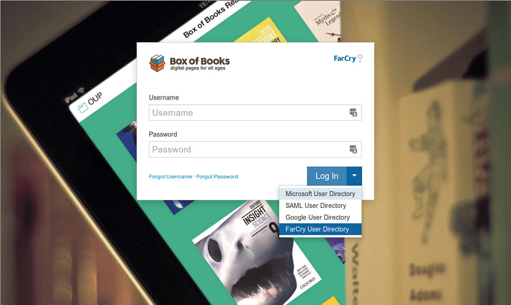
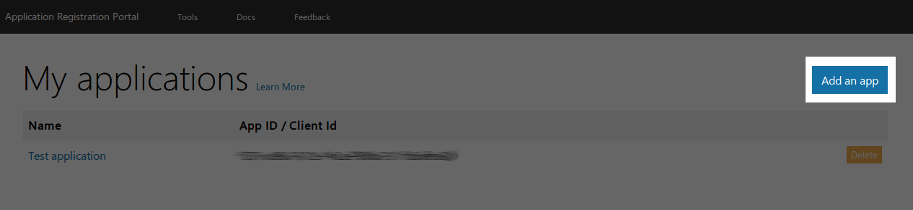
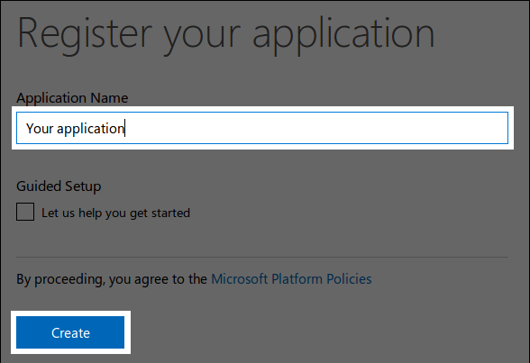
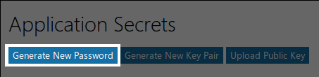

# Microsoft OAuth User Directory Plugin

## Overview

Microsoft UD provides federated logins for FarCry publishing platform using [OAuth 2.0 for Microsoft accounts]. You can set up Microsoft authentication as an option in the login, or the default login for immediate access to the webtop.



## Installation

### Part 1: MSFT App Configuration

Create a Microsoft Account and login to the [Application Registration Portal].

Add an App



Copy the Application Id to a text file for later. This will be the OAuth client
ID.

Enter an application name and click Create



Click Generate New Password and copy the generated password to a text file for
later.



You will need to add the links FarCry will be using. Click Add Platform and
select Web. This is the value to enter:

- redirect uris: `http://[your domain here]/mudLogin/displayLogin`

### Part 2: FarCry Configuration

Download and add the microsoftud plugin to your project:

<https://github.com/farcrycore/plugin-microsoftud>

Your plugin will typically be stored in `./farcry/plugins/microsoftud` and you can register it within your project by adding it to the `./www/farcryconstructor.cfm`. For example:

```
<cfset THIS.plugins = "microsoftud,googleanalytics" /> 
```

Update the application (ie restart the application) to register the newly added plugin.

Configure the plugin:

- Add the **Client ID** (aka Application ID) and **Client Secret** (aka Password) into the Microsoft User Directory configuration under `ADMIN > Configuration`.
- Deploy the new content types - **mudUser** and **mudGroup** through the webtop `ADMIN > Developer Tools > COAPI`. 
- Create a Microsoft user group (Admin -> General Admin -> User Directory -> Microsoft Groups) for your specific email domain (anyone logging in with an email within this domain will be automatically assigned to this group)
- Add your Group to the appropriate FarCry roles (Admin -> General Admin -> Roles & Permissions -> Roles)

## But wait, there's more!

Often you will have an existing account in the application you have added MicosoftUD to. 

This can lead to issues with:
- history tracking
- content ownership
- the old account won't be disabled

In the Webtop there is a utility for merging an existing account into your Microsoft UD login account.


[OAuth 2.0 for Microsoft accounts]: https://developer.microsoft.com/en-us/graph/docs/concepts/auth_v2_user
[Application Registration Portal]: https://apps.dev.microsoft.com/
